# IMDB-Clone

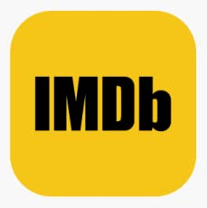

## Overview
A part of the IMDB app built with UIKit and Viper Architecture for OMDB API

## Features:
* Search Movie
* To see Writers
* To see Actors
* To see Movie Details
* - To save favorite movie (next update)
* - To see favorite movies (next update)

## Requirements
* iOS 13+
* Xcode 11.0+
* Swift 5.0+

## Clone the repository

`git clone https://github.com/sozman/IMDB-Clone.git`

## Setup API Key

### Generate API

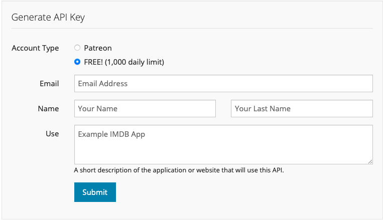

Go to [OMDB Web site](http://www.omdbapi.com/apikey.aspx) and than write your email address. The API Key will be sent your mail address.

### Get API Key

Please take a note for your api key

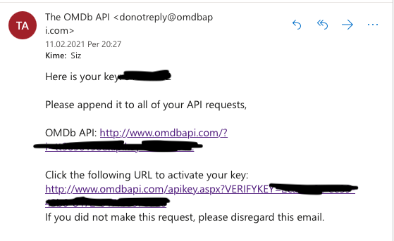

### Setup API Key

API Key Path
`IMDBClone -> Config -> Config.swift`

Change with your api key

`static var ApiKey = "&apikey=your api key"`

## Screenshots

### Search
| 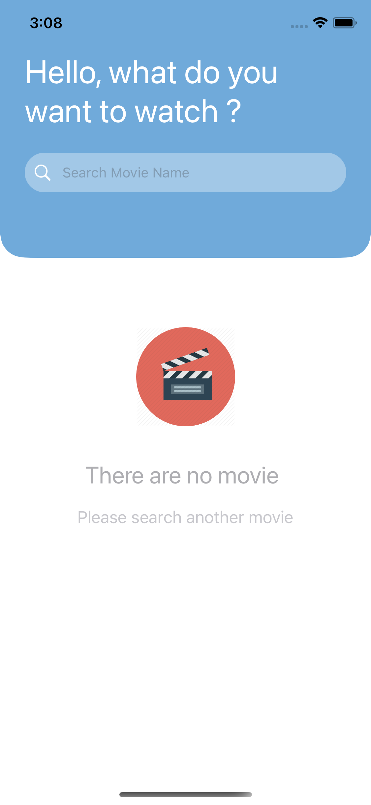 | 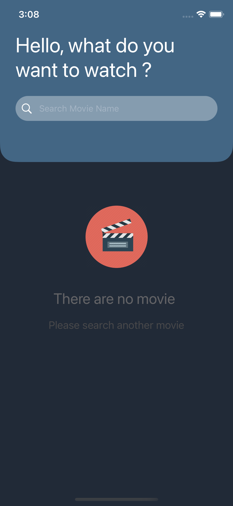 | 
|:---:|:---:|

### Search Typing
| 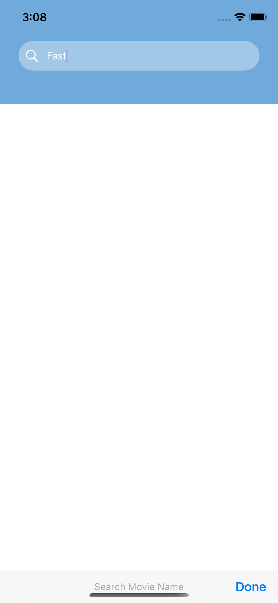 | 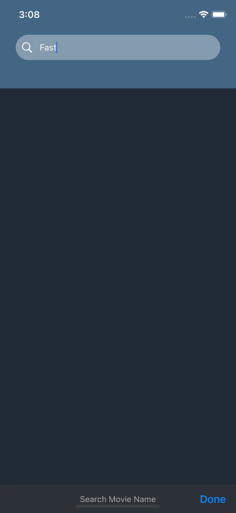 | 
|:---:|:---:|

### Result
| 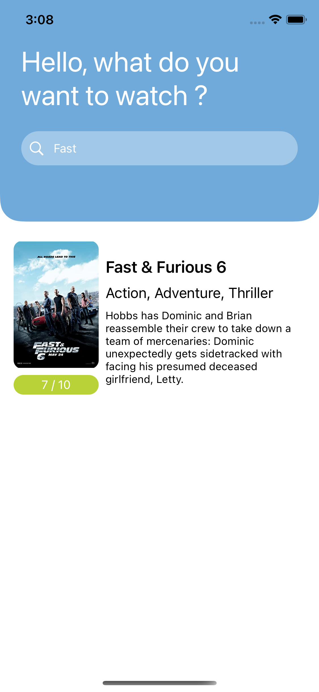 | 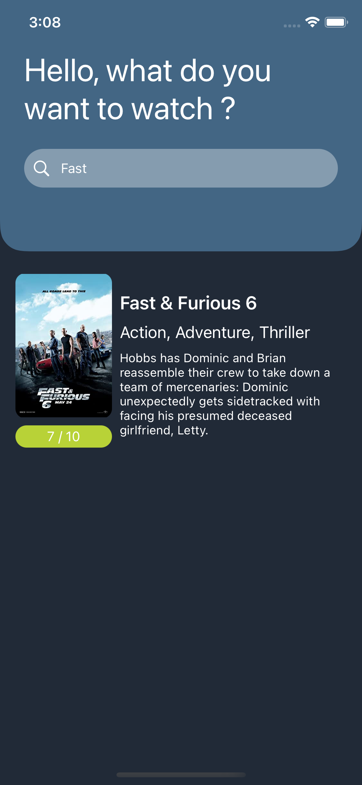 | 
|:---:|:---:|

### Detail
| 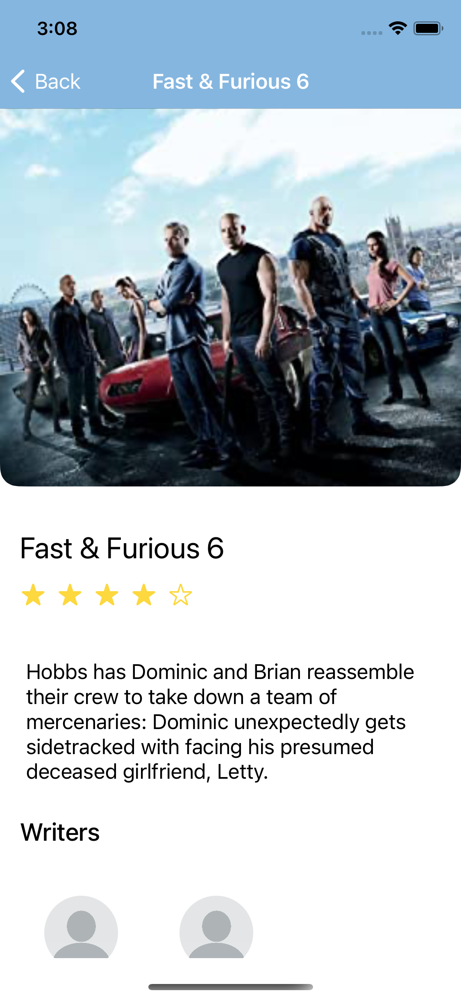 |  | 
|:---:|:---:|
| 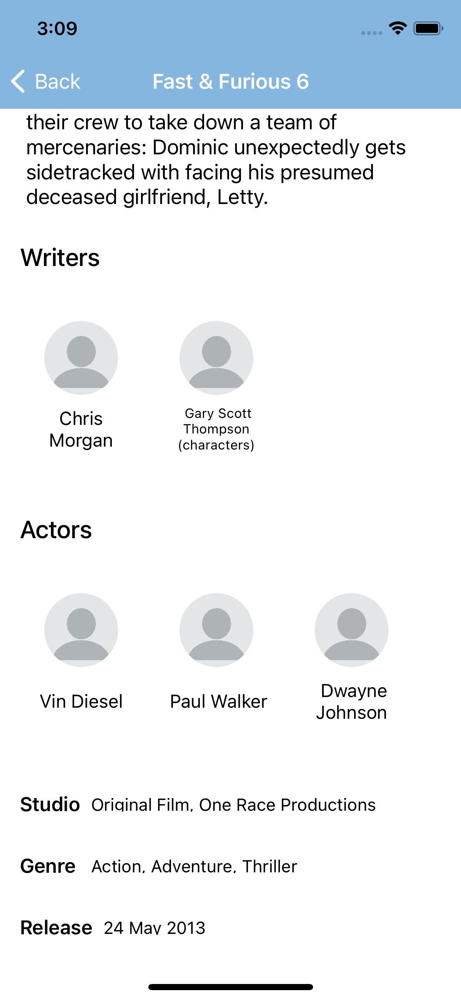 | 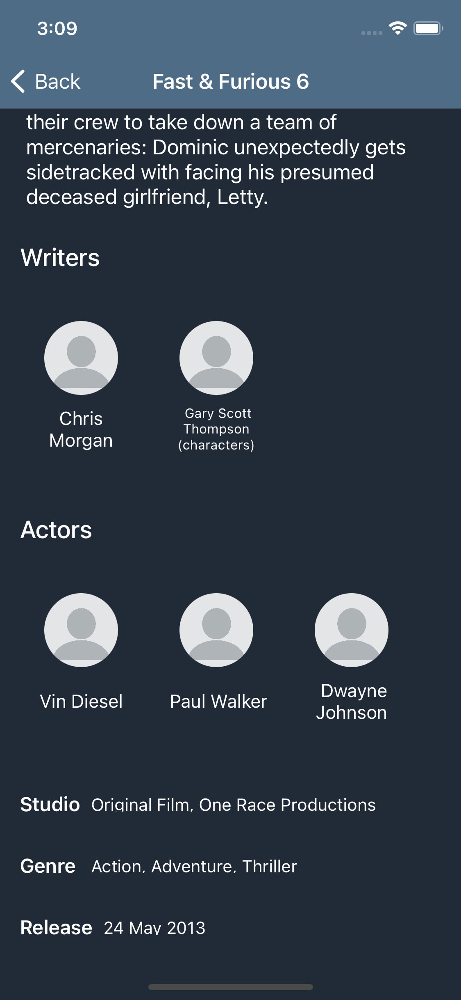 | 
|:---:|:---:|

## Author
Sinan Özman, sinanozman@icloud.com

## License
IMDB-Clone is available under the MIT License, see LICENSE for more information.

